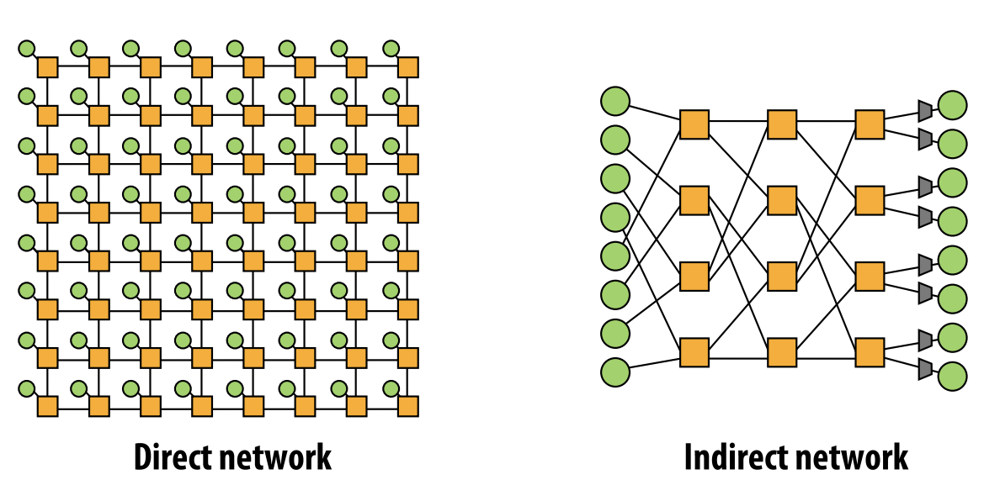

> This is about network in a single chip. We care about performance, energy efficiency and also scalability.

General rule: **latency increases with load**.

+ **interconnect component**
  + processor cores with other cores
  + processors and memories
  + processor cores and caches
  + caches and caches
  + I/O devices
+ How are hardware components interconnected?
+ What is the basic cost of communication?
+ How does data traverse the network?

## 1. terminology

+ network node: a network endpoint connected to a router/switch
+ network interface
  + connects nodes to the network
+ switch/router
  + connects a fixed number of input links to a fixed number of output links
+ link
  + a bundle of wires carrying a signal

## 2. design issues

+ **topology**: how switches are connected via links
+ **routing**: how a message gets from its source to its destination in the network
+ **buffering and flow control**
  + what data is stored in the network? packets, partial packets?
  + how does the network manage buffer space?

## 3. properties of interconnect topology

+ **routing distance**
  + diameter: the maximum routing distance between two nodes
  + average distance: average routing distance over all valid routes
+ **direct vs. indirect networks**
  + **direct network**: node在网络内部生成traffic，同时作为endpoint和switch
  + **indirect network**: node在网络边界生成traffic

+ **bisection bandwidth**: cut network in half, sum bandwidth of all severed links
+ **blocking vs. non-blocking**
  + non-blocking: 若节点集合一一映射进行通信且不存在冲突，则该网络是non-blocking的。

## 4. topology

### 4.1. bus interconnect

+ pros
  + simple design
  + cost effective for a small number of nodes
  + easy to implement coherence
+ cons
  + **contention**: all nodes contend for shared bus
  + **limited bandwidth**: all nodes communicate over same writes
  + high electrical load

### 4.2. crossbar

+ every node is connected to every other node (**non-blocking, indirect**)
+ pro
  + O(1) latency and high bandwidth
+ bad
  + O(N^2) switches
  + high cost
  + difficult to arbitrate at scale

### 4.3. ring

+ pro
  + simple
  + cheap: O(N) cost
+ con
  + **high latency**: O(N)
  + **scalability issue**: bisection bandwidth remains constant as nodes are added
+ ex
  + Core i7

### 4.4. mesh

+ direct network
+ O(N) cost
+ **average latency**: O(sqrt(N))
+ easy to lay out on chip: fixed-length links
+ **path diversity**: many ways for message to travel from one node to another
+ ex
  + tilera processors
  + prototype intel chips: xeon phi

### 4.5. torus

+ mesh topology are different based on whether node is near edge or middle of network
+ O(N) cost
+ **higher path diversity** and bisection BW than mesh
+ higher complexity
  + difficult to layout in chip
  + unequal link lengths

### 4.6. tree

+ latency: O(lgN)
+ "fat trees": alleviate root bandwidth problem (higher bandwidth links near root)

### 4.7. hypercube

+ low latency: O(lg N)
+ radix: O(lg N)
+ number of links O(N logN)

### 4.8. multi-stage logarithmic

## 5. buffering and flow control

+ **circuit switching**: preallocate all resources
  + higher bandwidth
  + low utilization
  + once setup, no contention
+ **packet switch**
  + higher utilization
  + overhead due to dynamic switching logic

### 5.1. communication granularity

+ **message**: unit of transfer between network clients, multiple of packets
+ **packet**: unit of transfer of network
  + header
  + payload
  + tail
+ **flit(flow control bit)**: a unit of flow control
  + packets broken into smaller units called "flits"
  + **minimum granularity of routing/buffering**
+ packet format
  + header: routing and control information
  + payload/body
  + tail: additional control information, error code

### 5.2. handling contention

contention: when two packets need to be routed onto the same outbound link at the same time

solution:

+ buffer one packet, send it over link later
+ drop one packet
+ reroute one packet (deflection)
+ circuit switching
  + no contention due to preallocation, so no need for buffering
  + arbitrary messages size

### 5.3. flow control

+ **store and forward**
  + **buffer**: channels and buffers are allocated per packet
  + **pro**: **each time use one link**
  + **flow control unit**: packet
  + **latency**: 由于需要先存储然后转发，若一个packet包含#flits则延迟为#flits * #links
+ **cut-through flow control**: 借助link进行pipeline式发送，即一个switch收到flit后立即转发
  + **switch starts forwarding data on next link as soon as packet header is received**
  + **buffer**: per packet channel
  + reduced latency
    + best latency = #links + #flits, 即header到达目的地的时间加上packet的flits的数量
    + worst latency: under high contention, reduces to store-and-forward contention
+ **wormhole flow control**
  + **buffer**: buffers are allocated per flit, reducing significantly
  + routing information only in **head flit**
  + policy:
    + body flits follows head, tail flit follows body, if head flit blocks, rest of packet stops
  + completely pipelined transmission
    + **for long messages, latency is independent of network distance**
    + latency = #links + #flits, for long message, #flits >> #links

prob: head-of-line blocking, 同一个buffer中后续抵达的packet的传输由于最先抵达的packet被阻塞而阻塞，即使后续抵达的需要被发往idle的端口。

+ **virtual channel flow control**
  + **divide switch's input buffer into multiple buffers sharing a single physical channel**
  + deadlock avoidance
  + prioritization of traffic classes
